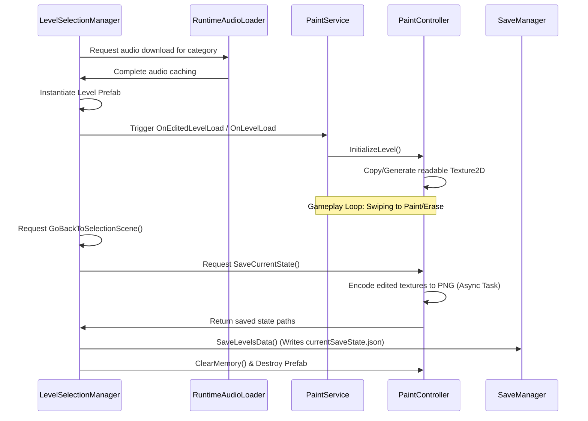

# TMKOC PlaySchool - Coloring & Drawing Game (Unity Project)

Welcome to the **ColoringGame** Unity project handover document. This repository contains the interactive coloring, drawing, and path-following minigames designed for the TMKOC PlaySchool application. It is optimized for mobile deployment (Android & iOS) and features dynamic AssetBundle loading, localized audio streaming, and robust offline progress tracking.

---

## 🎮 1. Project Overview
This project serves as a standalone educational minigame module integrated with the TMKOC PlaySchool ecosystem.
* **Educational Purpose:** Enhances fine motor skills, shape recognition, and vocabulary reinforcement (via multilingual voiceovers for drawn objects).
* **Target Platforms:** Mobile (Android & iOS).
* **Technical Stack:**
  * **Unity Version:** `Unity 6 (6000.0.62f1)`
  * **Render Pipeline:** Universal Render Pipeline (URP 17.0.4) configured with a **2D Renderer**.

---

## 🗺️ 2. Codebase Map & Key Entry Points

Below is a map of the critical scripts and folders that constitute the core systems:

| Repository Path | Component Type | Role & Responsibility |
| :--- | :--- | :--- |
| [`Assets/Scenes/PlayschoolMainScene.unity`](file:///d:/Unity_Projects/ColoringGame/Assets/Scenes/PlayschoolMainScene.unity) | Entry Scene | The main loader scene. Contains the UI category list and handles loading scene AssetBundles. |
| [`Assets/BundleTestandLoad.cs`](file:///d:/Unity_Projects/ColoringGame/Assets/BundleTestandLoad.cs) | Scene Loader | Asynchronously loads scenes directly from built AssetBundles (`colorswipe` or `swipetodraw`). |
| [`Assets/RuntimeAudioLoader.cs`](file:///d:/Unity_Projects/ColoringGame/Assets/RuntimeAudioLoader.cs) | Audio Loader | Singleton downloading, extracting, caching, and streaming language-specific game voiceovers on-demand. |
| [`Assets/_ColoringGame/Scripts/PaintingLogic/PaintService.cs`](file:///d:/Unity_Projects/ColoringGame/Assets/_ColoringGame/Scripts/PaintingLogic/PaintService.cs) | MonoBridge | Bridge script matching the `InputHandler` inputs to the paint controller commands. |
| [`Assets/_ColoringGame/Scripts/PaintingLogic/PaintController.cs`](file:///d:/Unity_Projects/ColoringGame/Assets/_ColoringGame/Scripts/PaintingLogic/PaintController.cs) | Logic Class | Core painting engine. Manages Raycasts, UV translation, RenderTextures, and shader paint applications. |
| [`Assets/_ColoringGame/Scripts/Manager/SaveManager.cs`](file:///d:/Unity_Projects/ColoringGame/Assets/_ColoringGame/Scripts/Manager/SaveManager.cs) | Save Handler | Manages JSON serialization (`currentSaveState.json`) of coloring level data, coordinates reloading saved states. |
| [`Assets/_ColoringGame/Scripts/ScriptableObjectDefinitions/LevelDataSO.cs`](file:///d:/Unity_Projects/ColoringGame/Assets/_ColoringGame/Scripts/ScriptableObjectDefinitions/LevelDataSO.cs) | Data Definition | Holds arrays of LevelData, coordinates exporting edited textures, and saves/loads them asynchronously. |
| [`Assets/PlaySchoolAPI/`](file:///d:/Unity_Projects/ColoringGame/Assets/PlaySchoolAPI) | Submodule Folder | Git submodule containing student profiling APIs, data persistence modules, and encryption utilities. |

---

## 🌿 3. Class Inheritance & Dependency Warning

### Inheritance Architecture
The project utilizes a generic singleton base pattern to manage global services:
* **`MonoBehaviour`**
  * └── **`GenericSingleton<T>`** (Custom wrapper ensuring thread-safe, single-instance scripts)
      * ├── **`AudioManager`** (Handles game UI sounds, SFX, and painting audio clips)
      * └── **`AudioMapper`** (Handles dictionary matching of gameplay keys to clips)

### ⚠️ Shared-Script Cascading Changes Warning
> [!WARNING]
> The scripts `PaintController.cs`, `PaintService.cs`, `LevelDataSO.cs`, `GenericSingleton.cs`, and `UpdateCategoryApiManager.cs` are **fully shared** dependencies across both the `ColorSwipe_Scene.unity` and `DrawPaint_Scene.unity` scenes. 
> Modifying any of these base classes, serialization layouts, or event systems can cause cascading compile breaks, state corruption, or runtime crashes in both game modes.
> **Safety Check Checklist before committing changes to shared scripts:**
> 1. Ensure you have built AssetBundles for both Windows and Android/iOS.
> 2. Open and test both `ColorSwipe_Scene` and `DrawPaint_Scene` individually in the editor.
> 3. Verify that changes to `LevelDataSO` do not corrupt existing `currentSaveState.json` or `drawingSaveState.json` files.

---

## 🔌 4. Event Bindings & Inspector Connections

### Inspector-Wired Events
These actions are wired directly inside the Unity Editor inspector (referenced via `m_MethodName` inside YAML files):

| Scene/Prefab Path | Target GameObject | Component Event | Target C# Method |
| :--- | :--- | :--- | :--- |
| `AssetLoad.unity` | `Canvas/CategorySelection/Button` | `Button.onClick` | `BundleTestandLoad.CallBundle` |
| `ColorSwipe_Scene.unity` | `Canvas/MainPanel/LeftPanel/CloseBtn` | `Button.onClick` | `LeftPanelController.CloseSidePanel` |
| `ColorSwipe_Scene.unity` | `Canvas/MainPanel/ExitBtn` | `Button.onClick` | `LevelSelectionManager.GoBackToSelectionScene` |
| `ColorSwipe_Scene.unity` | `Canvas/MainPanel/ClearBtn` | `Button.onClick` | `PaintService.ClearPainting` |
| `ColorSwipe_Scene.unity` | `Canvas/MainPanel/CameraBtn` | `Button.onClick` | `LevelSelectionManager.TakePhoto` |
| `ColorSwipe_Scene.unity` | `Canvas/MainPanel/EraserBtn` | `Button.onClick` | `PaintService.SelectEraser` |
| `ColorSwipe_Scene.unity` | `Canvas/MainPanel/LevelButtons/*` | `Button.onClick` | `LevelSelectionManager.LoadLevel` |
| `DrawPaint_Scene.unity` | `Canvas/MainPanel/LeftPanel/Colors/PencilCategory` | `Button.onClick` | `PenSelectionHandler.OnPenCategorySelection` |

### LevelSelectionManager UnityEvents
The `LevelSelectionManager` component (attached to the `LevelManager` GameObject in both scenes) exposes lifecycle `UnityEvent` triggers. They execute the following scene-specific configurations when levels are successfully resolved:

#### In `ColorSwipe_Scene.unity`
* **`OnLevelLoaded`**:
  * Calls `UI_PencilColorGenerator.MoveLeft()` to slide the color selection pens onto the screen.
  * Calls `AudioManager.PlayGameStartAudio()` to play the level starting sound.
  * Calls `InputHandler.set_IsTouchEnabled(true)` to unlock user swipe interactions.
* **`OnBackButtonPressed`**: No callbacks bound in this scene.

#### In `DrawPaint_Scene.unity`
* **`OnLevelLoaded`**:
  * Calls `PensHandler.MoveLeft()` to slide the drawing tools panel onto the screen.
  * Calls `CommonButtonFunctionsHandler.LoadButtonsAll()` (invoked twice) to initialize standard interface buttons.
  * Calls `InputHandler.set_IsTouchEnabled(true)` to unlock canvas drawing.
* **`OnBackButtonPressed`**: No callbacks bound in this scene.


### Programmatic Event Listeners
The following events are registered at runtime via C# scripts:

* **Input Event Pipeline (`PaintService.cs`)**:
  * Registers `OnBeginDrag` ➔ binds to `BeginDrag(Vector2)`
  * Registers `OnDragging` ➔ binds to `OnDrag(Vector2)`
  * Registers `OnDragEnd` ➔ binds to `EndDrag()`
  * Registers `OnDragStationary` ➔ binds to `OnDragStationary()`
* **UI Pen Selections (`PaintService.cs` & `UI_PencilItem.cs`)**:
  * Registers the static event `UI_PencilItem.OnPenSelected += ChangePenColor` on enable to update brush colors.
* **Category Selections (`BundleTestandLoad.cs`)**:
  * Registers button action listeners at runtime dynamically:
    ```csharp
    spawnedUIObject.GetComponent<Button>().onClick.AddListener(()=> {
        StartCoroutine(RuntimeAudioLoader.Instance.CategoryAudioDownlaodAndLoader(audiofolderName[index]));
        LoadGameScene(index);
    });
    ```

---

## 📦 5. Scene AssetBundle Configuration

### AssetBundle Mapping
The scenes in this project are decoupled into standalone bundles to keep the core player build size extremely small. 

| Scene Name | Source Path | Target AssetBundle | Output Target |
| :--- | :--- | :--- | :--- |
| `ColorSwipe_Scene` | `Assets/_ColoringGame/Scene/ColorSwipe_Scene.unity` | `colorswipe` | `Assets/StreamingAssets/windows/` or `android/` |
| `DrawPaint_Scene` | `Assets/_ColoringGame/Scene/DrawPaint_Scene.unity` | `swipetodraw` | `Assets/StreamingAssets/windows/` or `android/` |

### Bundle Loading System
Dynamic unloading and asynchronous loading are orchestrated by `BundleTestandLoad.cs`:
1. Unloads existing AssetBundles via `AssetBundle.UnloadAllAssetBundles(true)`.
2. Resolves the bundle's path using `Application.streamingAssetsPath`.
3. Loads the bundle asynchronously via `AssetBundle.LoadFromFileAsync(filePath)`.
4. Asynchronously opens the loaded scene using `SceneManager.LoadSceneAsync(scenePaths[sceneIndex])`.

### Build Pipeline Script
The AssetBundles can be built via `Assets/Editor/BuildBundles.cs`. Below is the pipeline compilation setup:

```csharp
using UnityEditor;
using UnityEngine;
using System.IO;

public class BuildBundles
{
    [MenuItem("Assets/Build AssetBundles/Build All")]
    static void BuildAllAssetBundles()
    {
        BuildBundlesForTarget(BuildTarget.Android, "android");
        BuildBundlesForTarget(BuildTarget.StandaloneWindows64, "windows");
    }

    static void BuildBundlesForTarget(BuildTarget buildTarget, string subFolder)
    {
        string assetBundleDirectory = Path.Combine("Assets/AssetBundles", subFolder);
        if (!Directory.Exists(assetBundleDirectory)) Directory.CreateDirectory(assetBundleDirectory);

        BuildPipeline.BuildAssetBundles(assetBundleDirectory, 
                                        BuildAssetBundleOptions.ChunkBasedCompression, 
                                        buildTarget);
        
        string streamingAssetsDirectory = Path.Combine(Application.streamingAssetsPath, subFolder);
        if (Directory.Exists(streamingAssetsDirectory)) Directory.Delete(streamingAssetsDirectory, true);
        Directory.CreateDirectory(streamingAssetsDirectory);

        foreach (string file in Directory.GetFiles(assetBundleDirectory))
        {
            if (file.EndsWith(".meta")) continue;
            File.Copy(file, Path.Combine(streamingAssetsDirectory, Path.GetFileName(file)), true);
        }
        AssetDatabase.Refresh();
    }
}
```

---

## 🛠️ 6. Main Gameplay Mechanics & Event Flow

### Gameplay Event Lifecycle



### Key Mechanics
* **Input Tracking:** `InputHandler.cs` locks touches to a single finger ID (`_activeFingerId`) to prevent palm-snapping. Distances between drags are calculated using fast `sqrMagnitude` comparison rather than expensive square roots.
* **Blitting Paints:** `PaintController.cs` interpolates coordinates between swipe frames and uses `Graphics.Blit` to apply brush materials (Color/Erase/Texture) on temporary RenderTextures, copying the final results back to the Sprite's texture via `Graphics.CopyTexture`.

### Mobile-Specific Optimizations
1. **GPU/CPU Safety Clamp:** Clamps absolute drawing updates to a maximum of `40 steps per frame` to prevent GPU frame freezes during fast swipes (essential for older mobile devices).
2. **Background File Writes:** Uses `System.Threading.Tasks.Task.Run()` to write PNG bytes to storage, preventing main-thread freezes.
3. **Graphics Resource Disposal:** Clears and releases RenderTextures using `RenderTexture.ReleaseTemporary` and runs explicit `Object.Destroy` calls on custom sprites when unloading scenes.
4. **ASTC Texture Compression:** Level target sprites are compressed to **ASTC 6x6** format on iOS builds to minimize VRAM footprints.

---

## 🔗 7. Submodule & API Integration

The project relies on the **`PlaySchoolAPI`** submodule (under `Assets/PlaySchoolAPI`) to sync progress data.

* **Progress Serialization:**
  * Uses `UpdateCategoryApiManager` to record score, attempts, stars, and play session timers.
  * Encrypts/decrypts game metrics via `EncyptedDecryptedData.cs` (AES format).
  * Stores data in `Application.persistentDataPath/{StudentName} resentGameData.dat`.
* **Loader Sync:** `BundleTestandLoad.cs` calls `UpdateCategoryApiManager.LoadAllGamePlayData()` on start to read completed stats and update progress banners in the category UI.

---

## ⚙️ 8. Setup & Troubleshooting Guide

### Developer Setup
1. Clone the project and its submodule dependency recursively:
   ```bash
   git clone --recurse-submodules https://github.com/bhaskarpal2611/ColoringGame.git
   ```
2. Open the project in Unity 6 (`6000.0.62f1`).
3. Compile level AssetBundles: Navigate to **Assets > Build AssetBundles > Build All**.

### Troubleshooting Pink Shaders
If sprites render as pink/magenta in the Editor or builds:
1. Go to **Tools > Fix Pink Shaders** in the top menu.
2. This runs `ShaderInclusionFixer.cs` which automatically inserts the required URP shaders (`Universal Render Pipeline/2D/Sprite-Lit-Default` and `Custom/PaintCircleTexture_URP6`) into the **Always Included Shaders** array under `ProjectSettings/GraphicsSettings.asset`.

---

## 🤖 9. Instructions for AI Maintainers

When an AI assistant is assigned to make modifications or upgrades to this repository, it must adhere to the following rules:

### 1. Adding a New Level or Scene
- Create a level prefab containing sprite renderers. Target sprite objects must contain 2D Colliders. If missing, `PaintController` will attempt to add a `PolygonCollider2D` dynamically, but it is best to set them up in the prefab.
- Open the corresponding `LevelDataSO` (or `DrawnDataSO` for drawing templates) and add a reference to the prefab in the levels list.
- Re-run the AssetBundle compile script (**Assets > Build AssetBundles > Build All**) so that the category selection menu loads the updated scene bundles.

### 2. Updating Voiceovers/Audio Files
- Language sound files must be zipped per language (e.g., `Tamil.zip`, `English.zip`) and uploaded to the Amazon Cloudfront bucket folder matching the category name:
  `https://d2r38fn3ydtrfq.cloudfront.net/{CategoryName}/{LanguageName}.zip`
- If adding support for a new language, update the `Language` enum inside `RuntimeAudioLoader.cs`.

### 3. Regression Testing Mandate
- **Pre-Commit Gate:** If you modify `PaintController.cs`, `PaintService.cs`, `LevelDataSO.cs`, `GenericSingleton.cs`, or `UpdateCategoryApiManager.cs`, you **must** build the AssetBundles and run/test both `ColorSwipe_Scene.unity` and `DrawPaint_Scene.unity` in the Unity Editor before completing the task. Verify that both drawing template levels and coloring levels save/load progress without throwing null reference exceptions.
